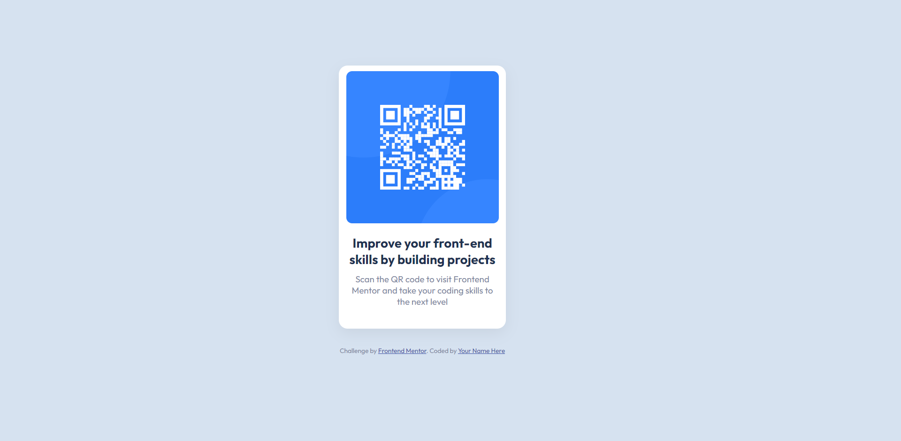

## Table of contents

- [Screenshot](#screenshot)
- [Links](#links)
- [Author](#author)
- [Acknowledgments](#acknowledgments)

### Screenshot

### Links

- Solution URL: [Add solution URL here](https://www.frontendmentor.io/solutions/qr-code-component-8byRayTRdu)
- Live Site URL: [Add live site URL here](https://dreamy-platypus-710113.netlify.app/)

## Author

- Frontend Mentor - [@yourusername](https://www.frontendmentor.io/profile/kadan-develop)
